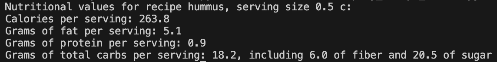
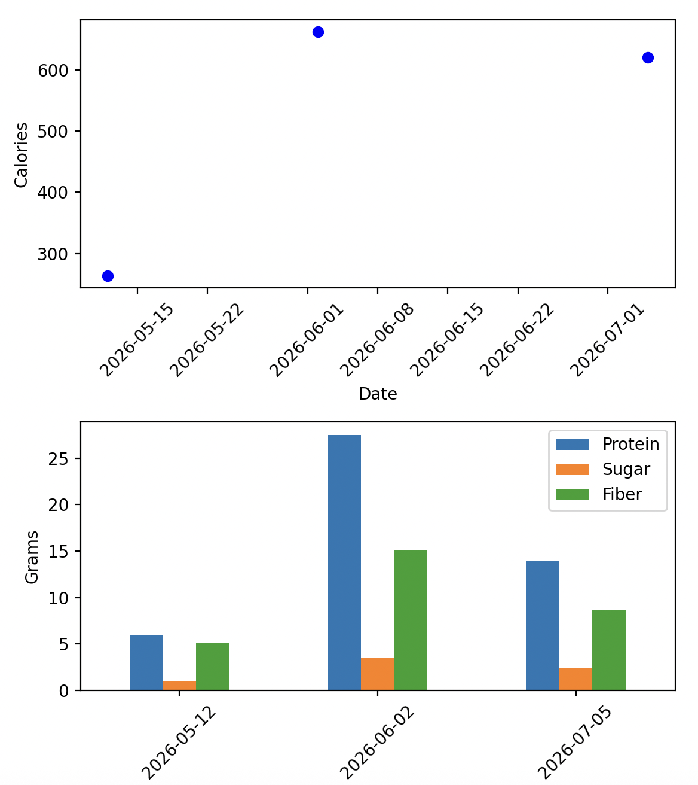

# ForkWise: Nutrition tracking app

ForkWise is designed around the principle that the first step towards making a change is, in health and nutrition as in many areas
of life, observation and tracking. ForkWise aims for enough accuracy to produce actionable data without such a high burden of data
entry as to be unuseable.

ForkWise logs daily meals and reports total calories, as well as fiber, sugar, and protein. Meals are recorded as instances of 
recipes that are stored in the database and are constructed from a basic set of ingredients. You can make the data as detailed as you need for your goals: different bagel brands will have slightly different nutritional content, so you can log breakfasts of different kinds of bagels separately; or you can just call them all "bagels" and enter an average amount of calories, etc in the ingredients list.

Progress towards health goals will fall out of the data provided by ForkWise; if I know that 20% of my daily sugar intake comes from 
one particular source, then that's the first place to look if I'm interested in reducing my daily sugar intake. The various reports generated by ForkWise aim to provide these kinds of actionable breakdowns.

The MVP tracks protein, sugar, fiber, whether an ingredient/recipe is vegan or not, and whether it contains white flour. The MVP will not track sodium or cholesterol. Later versions will support customizable tracking.

## Inputs

MVP: All inputs via csv. User provides csv of meals eaten on particular dates, corresponding to recipes in the db; formats specified below. Obviously this is not ideal for low burden of data entry, but it's a place to start.

Later versions: Extract recipes from URLs and/or images, get ingredient nutritional info from web search and/or images. GUI for meal logging.

Security: the database is hosted locally, nothing leaves your machine.

## Example usage

### A note about units

Since I don't yet have a BLL that checks/fixes file format, the db will only accept:

- lbs not lb as a unit of weight
- c not cup
- no whitespace characters around units

But units are case INsensitive.

### Add ingredients

Ingredients are loaded from a csv. The csv must have columns (in this order, no header):

- `Name`: Item name, e.g. "black beans"
- `Unitary amount`: Amount for which calories, etc are calculated
- `Units`: Units for amount; e.g. `oz`
- `Calories`: Calories in the unitary amount of this ingredient
- `Fiber`: g of fiber in the unitary amount of this ingredient
- `Sugar`: g of sugar
- `Protien`: g of protein
- `Fat`: g of fat
- `Carbs`: g of carbohydrate, total (incl sugar and dietary fiber)
- `White flour`: bool, true if the ingredient is predominantly white flour (eg 1 for an english muffin)
- `Animal`: bool, true if any part of the ingredient is derived from animal products.

E.g. for a can of black beans, `name` might be "black beans", `unitary amount` might be 24, `units` might be "oz". `Animal` would be True only if the beans were cooked in animal fat, for example.

As many ingredients as you want can be added per csv, one per row. Ingredients with the same name as an ingredient in the db will be skipped; a warning will show if an ingredient is added that is identical to an existing entry *except* for the name (e.g., if "black beans" is in the db and a new ingredient with identical unitary amount, calories etc is added as "black beans can"), but that potential duplicate will be added.

In the terminal, run:

```
python ./src/forkwise/add_ingredients.py <username> <user pw> <path_to_csv>
```

### Add recipe

A recipe can only be added if all ingredients are already in the db.

Recipes are added from a csv. *One recipe per csv*. The csv must have the columns (in this order, no header):

- `Ingredient`: Name of an ingredient already in the db (exact match in v1).
- `Amount`: Amount added to the recipe for all the servings (not per serving). 
- `Units`: Units of the ingredient (Tbps, c etc)

`Servings` (how many servings does this recipe make), `servings_amt` (amount one serving corresponds to, e.g. 1 if a serving is 1 cup), `servings_units` ('c' if a serving is 1 cup) and `name` (recipe name) must be specified separately on csv load.

In the terminal, run:

```
python ./src/forkwise/add_recipe.py <username> <user pw> <path_to_csv> <recipe_name> <servings> <servings_amt> <servings_units>
```

This will fail if a recipe by the same name already exists; or a recipe of a different name but the same exact ingredient list exists.

### Add meals

Meals can only be added for recipes already in the db.

Meals are added from a csv. A meals csv must have the columns (in this order, no header):

- `date`: date recipe was eaten. Format: mm/dd/yyyy
- `recipe name`: must match a recipe in the db
- `servings`: how many servings of this recipe were eaten on this date.

A meal is defined as all the recipes assigned to a particular date (breakfast vs lunch vs dinner etc are not differentiated,
although I think this will work fine if times-per-day are entered in ISO format - TODO check). One row per recipe eaten,
but multiple rows for the same date are fine (and multiple dates fine).

In the terminal, run:

```
python ./src/forkwise/add_meals.py <username> <user pw> <path_to_csv>
```

### View nutritional totals

To view nutritional content of a recipe logged in the database:
```
python ./src/forkwise/display_recipe_totals.py <username> <user pw> <recipe name>
```
For example, if `test_fork_db.py` has run but without the teardown method, and you run: (note you'll have to modify `config.yml` to point at `test_fork_db`)
```
python ./src/forkwise/display_recipe_totals.py test_fork_user pw hummus
```
the result is:




To view nutritial totals for meals in a date range: 
```
python ./src/forkwise/display_meal_totals.py <username> <user pw> <start_date> <end_date>
```
where `start_date` and `end_date` are in ISO format of YYYY-MM-DD.

For example, if `test_fork_db.py` has run but without the teardown method, and you run: (note you'll have to modify `config.yml` to point at `test_fork_db`)
```
python ./src/forkwise/display_meal_totals.py test_fork_user pw 2026-05-12 2026-07-05
```
the result is this plot:



## Getting started

One-time-only setup: initialize a new db:

```
python ./src/forkwise/fork_init.py <admin_pw>
```

where `admin_pw` is the pw to set for `admin_name` account (see config file for name of admin account).

Add new users:
```
python ./src/forkwise/add_fork_user.py <new_user_name> <new_user> <admin_pw>
```

To connect directly to the db via the terminal: TODO why don't I need to pass a pw ... 
```
psql -U <user_name> -d fork_db
```

## Version log

v1.0: All functionality of data entry by csv and recipe/daily meal reporting. Use it for a week or so, see where the pain points are and design a better data entry interface.

## Dev


*Schema diagram made at [QuickDataBaseDiagrams.com](https://app.quickdatabasediagrams.com), using a manual run of SQL_to_EDL.py from DBCommons (so inconsistency with actual db schema is possible!)*

This package uses `uv` for package and virtual environment management, based on the very helpful tutorials at [Sebastia Agramunt Puig's blog](https://agramunt.me/posts/python-virtual-environments-with-uv/).

Create the environment with `uv venv .venv` and then run `uv sync --all-extras` (to get developer extras).

Activate with `source .venv/bin/activate`.

Add dependencies with `uv add <package1> <package2>`. If you get an error that looks like:

```
No solution found when resolving dependencies:
  ╰─▶ Because there are no versions of unittest and your project depends on unittest, we can conclude that your project's requirements are
      unsatisfiable.
```
you already have the package (e.g. it's a package that comes with all python installs). I love `uv` but its error messages can be quite unhelpful.

To update to the latest version of the DBCommons repo, run:
```
uv pip install "git+https://github.com/stephlj/DBCommons"
```

Use `pytest` to run the tests. (For quick debugging: Add `-s` or `--capture=no` to print print statements to console.)

If you comment out the teardown, you can connect to the test db for debugging via the terminal:
```
psql -U test_fork_user -d test_fork_db
```