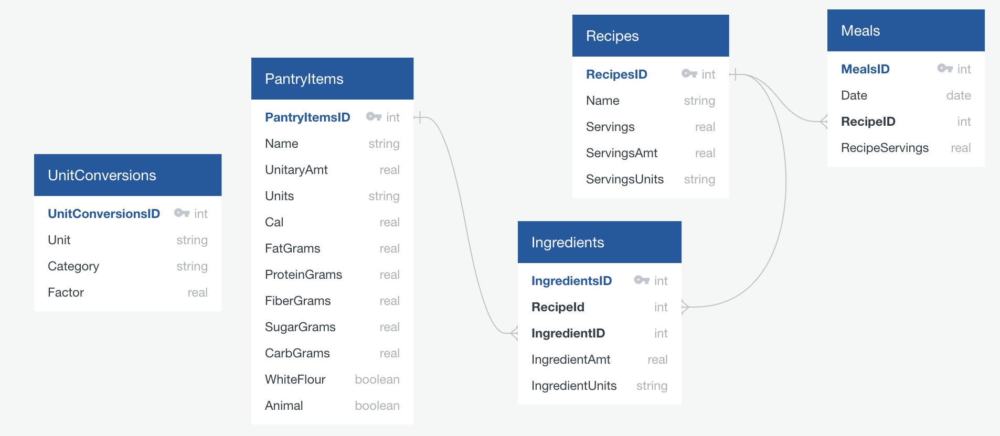

# ForkWise: Nutrition tracking app



*Schema diagram made at [QuickDataBaseDiagrams.com](https://app.quickdatabasediagrams.com), using SQL_to_EDL.py from [FinTracker](https://github.com/stephlj/FinTrackr) (so inconsistency with actual db schema is possible!)*

## Inputs

MVP: All inputs via csv. User provides csv of meals eaten on particular dates, corresponding to recipes in the db; formats specified below.

v2: Extract recipes from URLs, get ingredient nutritional info from web search.

Security: the database runs locally, nothing leaves your machine.

## Example usage

### A note about units

Since I don't yet have a BLL that checks/fixes file format, the db will only accept:

- lbs not lb as a unit of weight
- c not cup

But units are case insensitive.

### Add ingredients

Ingredients are loaded from a csv. The csv must have columns (in this order, no header):

- `Name`: Item name, e.g. "black beans"
- `Unitary amount`: Amount for which calories, etc are calculated
- `Units`: Units for amount; e.g. `oz`
- `Calories`: Calories in the unitary amount of this ingredient
- `Fiber`: g of fiber in the unitary amount of this ingredient
- `Sugar`: g of sugar; includes white flour
- `Protien`: g
- `Fat`: g
- `Carbs`: g of carbohydrate, total (incl sugar and dietary fiber)
- `Animal`: bool, is any part of the ingredient derived from animal products or not.

E.g. for a can of black beans, `name` might be "black beans", `unitary amount` might be 24, `units` might be "oz". `Animal` would be True only if the beans were cooked in animal fat, for example.

As many ingredients as you want can be added per csv, one per row.

In the terminal, run:

```
python ./src/forkwise/add_ingredients.py <username> <user pw> <path_to_csv>
```

### Add recipe

A recipe can only be added if all ingredients are already in the db.

Recipes are added from a csv. *One recipe per csv*. The csv must have the columns (in this order, no header):

- `Ingredient`: Name of an ingredient already in the db (exact match in v1).
- `Amount`: Amount added to the recipe for all the servings (not per serving). 
- `Units`: Units of the ingredient (Tbps, c etc)

`Servings` (how many servings does this recipe make), `servings_amt` (amount one serving corresponds to, e.g. 1 if a serving is 1 cup), `servings_units` ('c' if a serving is 1 cup) and `name` (recipe name) must be specified separately on csv load.

In the terminal, run:

```
python ./src/forkwise/add_recipe.py <username> <user pw> <path_to_csv> <recipe_name> <servings> <servings_amt> <servings_units>
```

This will fail if a recipe by the same name already exists; or a recipe of a different name but the same exact ingredient list exists.

### Add meals

WIP

### View nutritional totals

WIP

## Getting started

One-time-only setup: initialize a new db:

```
config_path='./src/forkwise/config.yml'
schema_path='./src/forkwise/schema.sql'
python -m dbcommons.init_db '<owner_pw>' $config_path $schema_path
```

## Dev

This package uses `uv` for package and virtual environment management, based on the very helpful tutorials at [Sebastia Agramunt Puig's blog](https://agramunt.me/posts/python-virtual-environments-with-uv/).

Create the environment with `uv venv .venv` and then run `uv sync --all-extras` (to get developer extras).

Activate with `source .venv/bin/activate`.

Add dependencies with `uv add <package1> <package2>`. If you get an error that looks like:

```
No solution found when resolving dependencies:
  ╰─▶ Because there are no versions of unittest and your project depends on unittest, we can conclude that your project's requirements are
      unsatisfiable.
```
you already have the package (e.g. it's a package that comes with all python installs). I love `uv` but its error messages can be quite unhelpful.

To update to the latest version of the DBCommons repo, run:
```
uv pip install "git+https://github.com/stephlj/DBCommons"
```

Use `pytest` to run the tests. (For quick debugging: Add `-s` or `--capture=no` to print print statements to console.)